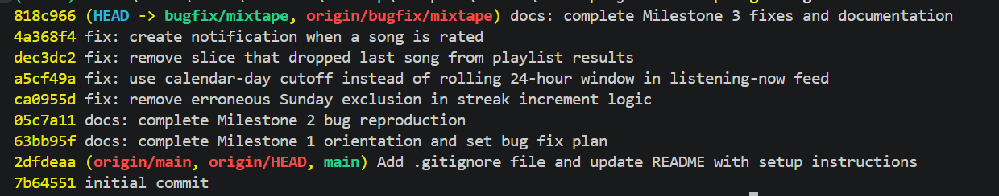

# Mixtape

A social music app where friends share songs, build collaborative playlists, and track listening stats.

This is the starter repo for **Project 5: Mixtape Bug Hunt**. The app has five open issues in its tracker. Your job is to find, fix, and document at least three of them.

---

## App Structure

```
ai201-project5-mixtape-starter/
├── app.py                      # Flask app factory and DB setup
├── models.py                   # SQLAlchemy models for all entities
├── routes/
│   ├── songs.py                # Song sharing, search, and rating routes
│   ├── playlists.py            # Playlist creation and song management
│   ├── users.py                # User profiles, streaks, notifications
│   └── feed.py                 # Friends listening now, activity feed
├── services/
│   ├── streak_service.py       # Listening streak logic
│   ├── feed_service.py         # Friends listening now feed logic
│   ├── search_service.py       # Song search logic
│   ├── notification_service.py # Notification creation and retrieval
│   └── playlist_service.py     # Playlist retrieval logic
├── tests/
│   ├── test_streaks.py
│   ├── test_search.py
│   └── test_playlists.py
├── seed_data.py                # Populates DB with test data
├── requirements.txt
└── .gitignore
```

The bugs live in the `services/` layer. The routes call services — if something is broken in an endpoint, trace it back to the service it calls.

---

<details>
<summary><strong>Setup</strong></summary>

Create and activate a virtual environment:

```bash
python -m venv .venv

# macOS / Linux
source .venv/bin/activate

# Windows (Command Prompt)
.venv\Scripts\activate.bat

# Windows (Git Bash)
source .venv/Scripts/activate
```

Install dependencies:

```bash
pip install -r requirements.txt
```

Seed the database with test data:

```bash
python seed_data.py
```

Run the app:

```bash
FLASK_APP=app:create_app flask run
```

> **macOS note:** If the app starts but requests hang or return connection refused, try `http://127.0.0.1:5000` instead of `http://localhost:5000`. On macOS, `localhost` sometimes resolves to an IPv6 address that Flask isn't listening on.

Run tests:

```bash
pytest tests/
```

## </details>

<details>
<summary></strong>The Five Open Issues</strong></summary>

| #   | Title                                                                               | Affected service          |
| --- | ----------------------------------------------------------------------------------- | ------------------------- |
| 1   | My listening streak keeps resetting                                                 | `streak_service.py`       |
| 2   | Friends Listening Now shows people from yesterday                                   | `feed_service.py`         |
| 3   | The same song keeps showing up twice in search                                      | `search_service.py`       |
| 4   | I got notified when a friend added my song to a playlist but not when they rated it | `notification_service.py` |
| 5   | The last song in a playlist never shows up                                          | `playlist_service.py`     |

Full issue descriptions are in the **Project 5 brief**. Read them carefully before opening any service file.

</details>

---

## How to Read the Code

Start with `models.py` to understand the data model. Then trace a feature through from its route to its service. For example:

- A user rates a song → `POST /songs/<song_id>/rate` → `routes/songs.py` → `notification_service.rate_song()`
- A user views a playlist → `GET /playlists/<id>/songs` → `routes/playlists.py` → `playlist_service.get_playlist_songs()`

Understanding the full call chain is part of the exercise — don't skip to the service file directly.

---

## Submission

Create a branch named `bugfix/mixtape` for your fixes. Each bug fix should be its own commit using conventional format:

```
fix: correct Sunday boundary condition in streak reset logic
```

See the project brief for full submission requirements.

---

## Progress

\*\*Milestone 1

<details>
<summary><strong>Fork, Set Up, and Orient Yourself: Complete</strong></summary>

- Repo forked and cloned; `bugfix/mixtape` branch created
- Environment set up, dependencies installed, database seeded
- App confirmed running locally via `FLASK_APP=app:create_app flask run`
- Codebase map and data flow trace written in `submission.md`
- All five issue descriptions read
</details>

\*\*Milestone 2

<details>
<summary><strong>Reproduce Chosen Bugs: Complete</strong></summary>

- Issue #1 (streak) reproduced via `flask shell` with controlled Saturday/Sunday datetimes
- Issue #3 (search duplicates) investigated thoroughly: the raw SQL join does produce duplicate rows for multi-tag songs, but `search_songs()` queries full ORM entities, which deduplicate by primary key in this SQLAlchemy version. The existing regression test `test_search_no_duplicates_multi_tag_song` passes. **Bug does not reproduce in this environment** — swapped out in favor of Issue #2.
- Issue #2 (stale feed entries) reproduced via `flask shell` with a controlled "yesterday" listening event, confirming the rolling 24-hour window includes events from the previous calendar day
- Issue #5 (playlist truncation) reproduced via live HTTP GET: playlist with 7 songs in `playlist_entries` returns only 6 via the API
- Issue #4 (notifications, stretch) reproduced via live HTTP POST + GET: rating saves successfully but no notification is created for the song's original sharer
</details>

**Updated bug plan:**

| Issue                            | Status                                                           |
| -------------------------------- | ---------------------------------------------------------------- |
| #1 — Streak resets on Sunday     | Required fix                                                     |
| #2 — Stale feed entries          | Required fix                                                     |
| #5 — Last playlist song missing  | Required fix                                                     |
| #4 — Missing rating notification | Stretch fix                                                      |
| Regression test (streak or feed) | Stretch deliverable                                              |
| #3 — Duplicate search results    | Investigated, does not reproduce in this environment — not fixed |

\*\*Milestone 3

<details>
<summary><strong>Investigate, Fix, and Document Each Bug: Complete</strong></summary>

- Issue #1 (streak) fixed: removed the `today.weekday() != 6` condition that wrongly excluded Sundays from incrementing the streak
- Issue #2 (stale feed) fixed: replaced the rolling 24-hour `RECENT_THRESHOLD` cutoff with a calendar-day (midnight UTC) cutoff
- Issue #5 (playlist truncation) fixed: removed the `[:-1]` slice that unconditionally dropped the last song from playlist results
- Issue #4 (missing rating notification, stretch) fixed: added a `create_notification()` call to `rate_song`, mirroring the existing pattern in `add_to_playlist`
- Issue #3 (search duplicates) remains investigated but unfixed — confirmed the missing `.distinct()` is a real code smell, but it does not produce user-visible duplicates in this environment
- All four fixes verified against relevant test suites (`test_streaks.py`, `test_playlists.py`) or live HTTP checks where no test file existed (feed, notifications), each committed as its own `fix:` commit
- Complete 5-field root cause analysis entries written for all four fixed bugs, plus a documented investigation note for Issue #3, in `submission.md`
- Regression test stretch goal satisfied by the pre-existing `test_streak_increments_on_sunday`, which now passes after the Issue #1 fix
</details>

**Updated bug plan:**

| Issue                            | Status                                                           |
| -------------------------------- | ---------------------------------------------------------------- |
| #1 — Streak resets on Sunday     | Fixed                                                            |
| #2 — Stale feed entries          | Fixed                                                            |
| #5 — Last playlist song missing  | Fixed                                                            |
| #4 — Missing rating notification | Fixed (stretch)                                                  |
| Regression test                  | Satisfied via existing `test_streak_increments_on_sunday`        |
| #3 — Duplicate search results    | Investigated, not fixed (does not reproduce in this environment) |

\*\*Milestone 4

<details>
<summary><strong>Final Review and AI Usage: Complete</strong></summary>

- Verified commit history via `git log --oneline`: 4 separate `fix:` commits (one per bug), each with a descriptive message, all on `bugfix/mixtape` and pushed to `origin/bugfix/mixtape`
- Reviewed all root cause analysis entries in `submission.md` for completeness against the 5 required fields (issue/title, how reproduced, how found root cause, the root cause, fix + side-effect check)
- Wrote the AI Usage section, describing how AI was used for codebase orientation, reproduction strategy design, root cause comparison against working precedent, and verification/correction during Issue #2's and Issue #3's investigations
</details>

# screenshot of bug fix commits



**Final status: submission complete.**

| Issue                            | Status                                                           |
| -------------------------------- | ---------------------------------------------------------------- |
| #1 — Streak resets on Sunday     | Fixed                                                            |
| #2 — Stale feed entries          | Fixed                                                            |
| #5 — Last playlist song missing  | Fixed                                                            |
| #4 — Missing rating notification | Fixed (stretch)                                                  |
| Regression test                  | Satisfied via existing `test_streak_increments_on_sunday`        |
| #3 — Duplicate search results    | Investigated, not fixed (does not reproduce in this environment) |
