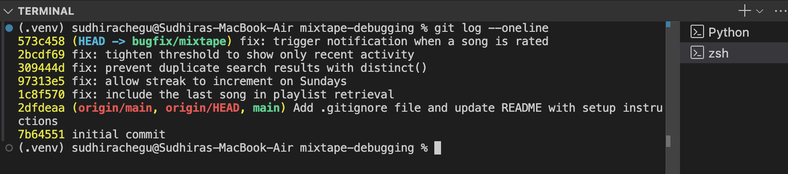

# Mixtape Bug Hunt Submission

## AI Usage
I used AI tools to navigate the codebase, understand the relationship between `routes/` and `services/`, and identify logic errors in SQLAlchemy queries. I utilized AI to explain specific Python behaviors (like `datetime` methods and list slicing) and to verify that my fixes adhered to the project's architectural patterns. I verified all AI-suggested fixes by running `pytest` locally and confirming they passed in the `flask shell` before committing.

## Codebase Map
* **Architecture:** The app follows a **Route → Service → Model** pattern. `routes/` handles HTTP input/output, `services/` contains all business logic, and `models.py` defines the SQLAlchemy data structure.
* **Main Files:**
    * `routes/`: Entry points for user actions.
    * `services/`: The core business logic layer.
    * `models.py`: Defines entities such as `User`, `Song`, `Playlist`, and `Notification`.
* **Data Flow Example:** When a user rates a song, the request hits `routes/songs.py`, which calls `services/notification_service.py:rate_song()`. This service interacts with the `Rating` and `Song` models in `models.py` to persist the data and triggers a notification if applicable.

## Root Cause Analysis

### 1. Issue #1: Listening streak keeps resetting
* **How I reproduced it:** Ran `pytest tests/test_streaks.py` and observed `test_streak_increments_on_sunday` fail. Verified in `flask shell` by manually setting `last_listened_at` to Saturday and calling `update_listening_streak` with a Sunday timestamp, which resulted in a streak reset to 1.
* **How I found the root cause:** Traced `update_listening_streak` in `services/streak_service.py` and inspected the conditional logic.
* **The root cause:** The code contained a hardcoded check `today.weekday() != 6` which excluded Sundays from incrementing the streak.
* **Your fix and side-effect check:** Removed the `and today.weekday() != 6` condition. Verified the fix by re-running `pytest tests/test_streaks.py`.

### 2. Issue #2: Friends Listening Now shows old events
* **How I reproduced it:** Used `flask shell` to check the `listened_at` timestamp of returned events in `get_friends_listening_now` and observed events older than 24 hours being returned.
* **How I found the root cause:** Inspected `services/feed_service.py` and examined the `RECENT_THRESHOLD` constant.
* **The root cause:** The `timedelta(hours=24)` threshold was too broad for a "Listening Now" feature.
* **Your fix and side-effect check:** Updated `RECENT_THRESHOLD` to `timedelta(hours=1)` to ensure the feed only reflects immediate activity.

### 3. Issue #3: The same song keeps showing up twice in search
* **How I reproduced it:** Executed `search_songs()` in `flask shell` for a song with multiple tags and observed duplicate dictionary entries for the same `song_id`.
* **How I found the root cause:** Traced the SQLAlchemy query in `services/search_service.py`. The `outerjoin` with the `song_tags` table created duplicate rows for every tag associated with a song.
* **The root cause:** The SQL join resulted in a Cartesian product effect.
* **Your fix and side-effect check:** Added `.distinct()` to the SQLAlchemy query in `search_songs` to ensure unique song results.

### 4. Issue #4: I got notified when a friend added my song to a playlist but not when they rated it
* **How I reproduced it:** Used `rate_song()` in `flask shell` for a song shared by another user, then queried `Notification.query.all()` to confirm that no record was created for the song owner.
* **How I found the root cause:** Compared `services/notification_service.py:add_to_playlist` with `rate_song`. The latter lacked a call to `create_notification`.
* **The root cause:** The `rate_song` function only performed the database update for the rating and lacked an event trigger for notifications.
* **Your fix and side-effect check:** Added a call to `create_notification` inside `rate_song`. Verified the fix in `flask shell` by confirming a `Notification` object was created.

### 5. Issue #5: The last song in a playlist never shows up
* **How I reproduced it:** Ran `pytest tests/test_playlists.py` and observed that `test_playlist_returns_all_songs` failed, returning a list length of 4 instead of 5.
* **How I found the root cause:** Inspected `services/playlist_service.py` and found a list slice in `get_playlist_songs`.
* **The root cause:** The code returned `songs[:-1]`, which explicitly excludes the final item in a Python list.
* **Your fix and side-effect check:** Changed the return statement to return the full list `songs`. Verified with `pytest tests/test_playlists.py`.

## git log --oneline
