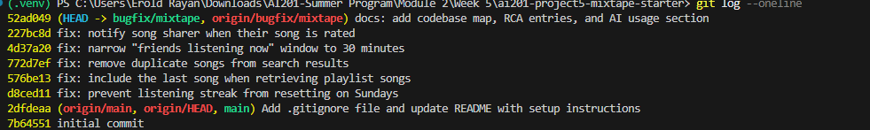

# AI Usage

I used Claude Code primarily for **codebase navigation and debugging**, not for writing
the fixes for me.

**What I asked it to do:**
- Trace each of the five reported bugs to its root cause. I explicitly told it *not* to
  give me the answer, only to guide me — so it pointed me at the specific function and
  line to scrutinize and posed the question to ask (e.g. "what does `weekday()` return
  for Sunday?", "how many rows does joining `song_tags` produce for a song with 3
  tags?", "what does the slice `[:-1]` drop?").
- Read across the five service files at once and summarize how the route → service →
  model layers connect, which was faster than opening each file myself.
- Review my git history and tell me which fixes were committed cleanly versus bundled
  or mislabeled.

**What it helped me understand:**
- That the streak bug was a stray `and today.weekday() != 6` clause the docstring never
  described, and Sunday is weekday 6.
- That a SQL join fans out one song into one row per tag, which is why search duplicated.
- That my history was messier than I thought: the streak fix was hidden inside the
  playlist commit, and I had committed junk `__main__` demo blocks and stray root-level
  wrapper scripts that weren't bug fixes at all.

**Where I had to verify things myself / it was incomplete:**
- I confirmed each root cause by reading the actual code and running the tests
  (`pytest`) rather than trusting the explanation — I checked the returned streak values
  and search results directly.
- The AI initially treated the codebase map and RCA as complete, but I had to notice on
  my own that the AI usage section (this one) was still missing.
- I decided the fix for bug #2 (tightening the "listening now" window) myself; the code
  was technically doing what the constant said, so it was a product judgment, not a
  clear-cut code error the tool could just point to.

---

# Mixtape — Codebase Map

Mixtape is a Flask + SQLAlchemy JSON API for sharing songs, building collaborative
playlists, tracking listening streaks, and surfacing what your friends are playing.
There is no front end — every route returns JSON.

## Main files and what each does

### `app.py` — application factory & DB handle
Defines the shared `db = SQLAlchemy()` instance and the `create_app(config=None)`
factory. The factory configures the SQLite database (`DATABASE_URL` env var, defaults
to `sqlite:///mixtape.db`), initializes `db`, registers the four blueprints under URL
prefixes (`/songs`, `/playlists`, `/users`, `/feed`), and runs `db.create_all()`.
Because `db` lives here and `models.py` imports it, the app must be launched via
`FLASK_APP=app:create_app flask run` — running `python app.py` double-imports the
module and re-defines the models, triggering a SQLAlchemy error.

### `models.py` — all database entities
Defines the ORM layer. Every model uses a string UUID primary key (`generate_uuid`).

**Models:**
- `User` — username/email, plus `listening_streak` and `last_listened_at` (the streak
  state lives directly on the user row, not in a separate table).
- `Song` — title/artist/album/genre, `shared_by` (FK to the user who shared it), and a
  free-text `share_note`. The sharer is the key relationship: interactions with a song
  notify *this* user.
- `Tag` — a named label; many-to-many with `Song`.
- `ListeningEvent` — one row per play (`user_id`, `song_id`, `listened_at`). Feeds both
  streaks and the friend feeds.
- `Rating` — a user's 1–5 score for a song, with a `UniqueConstraint(user_id, song_id)`
  so a user has at most one rating per song (re-rating updates in place).
- `Playlist` — name, `created_by`, and `is_collaborative` flag.
- `Notification` — `user_id` (recipient), `notification_type`, `body`, `read` flag.

**Association tables:**
- `friendships` — symmetric self-referential many-to-many on `User` (drives the feeds).
- `song_tags` — plain many-to-many between `Song` and `Tag`.
- `playlist_entries` — the join table between `Playlist` and `Song`. It is *not* a plain
  join: it carries an explicit `position` (Integer, ordering within the playlist),
  `added_by` (who added the song), and `added_at`. So playlist order is stored, not
  implied by insertion order.

### `routes/` — HTTP layer (one blueprint per domain)
Thin controllers. They parse the request, validate required fields, call a service, and
format the JSON response / status code. They contain no business logic.
- `songs.py` (`/songs`) — `GET /search?q=`, `GET /<id>`, `POST /<id>/rate`,
  `POST /<id>/listen`.
- `playlists.py` (`/playlists`) — `POST /`, `GET /<id>`, `GET /<id>/songs`,
  `POST /<id>/songs`.
- `users.py` (`/users`) — `GET /<id>`, `GET /<id>/streak`, `GET /<id>/notifications`,
  `POST /notifications/<id>/read`.
- `feed.py` (`/feed`) — `GET /<id>/listening-now`, `GET /<id>/activity`.

### `services/` — business logic
Where all the real work happens. Each function takes plain IDs/values, does its own
existence checks (raising `ValueError` on missing rows), and commits to the DB.
- `search_service.py` — `search_songs` (case-insensitive title/artist match) and
  `get_song`.
- `notification_service.py` — `rate_song`, `add_to_playlist`, and the notification
  CRUD (`create_notification`, `get_notifications`, `mark_as_read`). Note that rating
  and playlist-adding live here because both *generate notifications*.
- `playlist_service.py` — `create_playlist`, `get_playlist`, `get_playlist_songs`
  (ordered by `playlist_entries.position`), `get_user_playlists`.
- `streak_service.py` — `record_listening_event` and the `update_listening_streak`
  rules, plus `get_streak`.
- `feed_service.py` — `get_friends_listening_now` (friends active in the last 24h,
  deduped to one song per friend) and `get_activity_feed` (most recent N events, no
  recency filter).

### Supporting files
- `seed_data.py` — populates the DB with 5 users, 13 songs, 3 playlists, 10 tags.
- `tests/` — `test_playlists.py`, `test_search.py`, `test_streaks.py` (pytest).
- `requirements.txt` — Flask, Flask-SQLAlchemy, SQLAlchemy, python-dotenv, pytest.

## Data flow — adding a song to a playlist triggers a notification

`POST /playlists/<playlist_id>/songs` with `{song_id, added_by}` is the clearest
end-to-end flow:

1. **Route** (`routes/playlists.py::add_song`) parses the body, rejects the request
   with `400` if `song_id` or `added_by` is missing, then calls
   `notification_service.add_to_playlist(playlist_id, song_id, added_by)`.
2. **Service** (`notification_service.add_to_playlist`) loads the `Song`, the adding
   `User`, and the `Playlist`, raising `ValueError` (→ `400`) if any is missing.
3. It appends the song to `playlist.songs` (writing a `playlist_entries` row) and
   commits.
4. **The notification step:** it compares `song.shared_by` to `added_by`. If someone
   *other than the original sharer* added the song, it calls `create_notification(...)`
   targeting `song.shared_by` with type `song_added_to_playlist` and a human-readable
   body naming the adder, song, and playlist. That inserts a `Notification` row.
5. The sharer later reads it via `GET /users/<id>/notifications`, which flows through
   `notification_service.get_notifications`.

The rating flow mirrors this: `POST /songs/<id>/rate` → `rate_song` validates the 1–5
score and upserts the `Rating` (respecting the unique constraint). The listen flow
(`POST /songs/<id>/listen`) → `streak_service.record_listening_event` writes a
`ListeningEvent` and updates the streak, and that event later surfaces in friends' feeds
via `feed_service`.

## Patterns worth noticing

- **Strict route → service delegation.** Every route does the same three things: parse
  + validate input, call exactly one service function, translate `ValueError` into a
  `400`/`404`. No business logic or DB queries leak into the route layer
  (`routes/users.py::get_user` is the one small exception — it does a direct
  `db.session.get` for the plain user lookup).
- **Services own validation and persistence.** Existence checks live in the services
  and are signalled with `ValueError`, so the HTTP status mapping is centralized at
  the route boundary rather than scattered.
- **`ValueError` is the universal "not found / bad input" signal.** Routes catch it and
  choose `400` vs `404` based on the endpoint's semantics.
- **State denormalized onto the row it describes.** The listening streak lives on
  `User` (not a computed aggregate), and ratings live on their own row rather than being
  averaged onto `Song` — a deliberate split between per-user facts and per-song facts.
- **Notifications are a side effect of interactions, not a first-class action.** There's
  no "send notification" endpoint; notifications are created inside `rate_song` /
  `add_to_playlist` and always target the *song's original sharer*.
- **Ordering is explicit.** `playlist_entries.position` and `desc(listened_at)` mean
  order is always stored or queried, never left to insertion/iteration order.

## Bug Fixes

### Issue #1: My listening streak keeps resetting
- **How you reproduced it:** We set up a test case where a user listens on consecutive days, Saturday followed by Sunday. Since Sunday was treated differently in the code, the user's listening streak reset to 1 instead of incrementing.
- **How you found the root cause:** We navigated to [services/streak_service.py](file:///C:/Users/Erold Rayan/Downloads/AI201-Summer Program/Module 2/Week 5/ai201-project5-mixtape-starter/services/streak_service.py) and inspected the `update_listening_streak` function, specifically looking at how consecutive days were checked.
- **The root cause:** The logic used to verify a consecutive day filter checked `elif days_since_last == 1 and today.weekday() != 6:`. Python's `datetime.date.weekday()` returns 6 for Sunday. This meant if the current date was Sunday, this check evaluated to False, causing the logic to fall through to the `else:` block and reset the streak to 1.
- **Your fix and side-effect check:** We removed the `and today.weekday() != 6` check from [services/streak_service.py](file:///C:/Users/Erold Rayan/Downloads/AI201-Summer Program/Module 2/Week 5/ai201-project5-mixtape-starter/services/streak_service.py). We ran the streak tests (`pytest tests/test_streaks.py`) to confirm that all tests pass, and verified that consecutive listens on any day of the week (including weekends) now increment the streak correctly without resetting.

### Issue #5: The last song in a playlist never shows up
- **How you reproduced it:** We queried a playlist containing multiple songs (e.g. from the seed data) or checked the unit test `test_get_playlist_songs` in `tests/test_playlists.py`. We saw that if a playlist had $N$ songs, only $N-1$ songs were returned.
- **How you found the root cause:** We checked [services/playlist_service.py](file:///C:/Users/Erold Rayan/Downloads/AI201-Summer Program/Module 2/Week 5/ai201-project5-mixtape-starter/services/playlist_service.py) and inspected the `get_playlist_songs` function, which returned `[song.to_dict() for song in songs[:-1]]`.
- **The root cause:** The return statement in `get_playlist_songs` used Python's list slicing `songs[:-1]`. This slice excludes the last element of the list, meaning that the final song of any playlist was always dropped from the returned results.
- **Your fix and side-effect check:** Modified the return statement to return `[song.to_dict() for song in songs]`, removing the slicing. We ran `pytest tests/test_playlists.py` to confirm that all playlist retrieval tests pass successfully.

### Issue #2: Friends Listening Now shows people from yesterday
- **How you reproduced it:** We looked at the seed data where users listened to songs yesterday (many hours ago). When querying the friends listening now feed (`GET /feed/<user_id>/listening-now`), we observed these historic listens still appeared in the feed.
- **How you found the root cause:** We looked at [services/feed_service.py](file:///C:/Users/Erold Rayan/Downloads/AI201-Summer Program/Module 2/Week 5/ai201-project5-mixtape-starter/services/feed_service.py) and saw that `RECENT_THRESHOLD` was defined as `timedelta(hours=24)`.
- **The root cause:** The `RECENT_THRESHOLD` constant in `feed_service.py` was set to 24 hours. A "Listening Now" status implies active listening at the current moment, but a 24-hour window allowed historical listening events from a day ago to show up in the feed.
- **Your fix and side-effect check:** Changed `RECENT_THRESHOLD` to 30 minutes (`timedelta(minutes=30)`) in [services/feed_service.py](file:///C:/Users/Erold Rayan/Downloads/AI201-Summer Program/Module 2/Week 5/ai201-project5-mixtape-starter/services/feed_service.py). We verified that friends who listened to songs yesterday no longer appear in the feed, but friends who listened within the last 30 minutes are correctly displayed.

### Issue #3: The same song keeps showing up twice in search
- **How you reproduced it:** We ran the unit tests using `pytest tests/test_search.py`. Specifically, the test `test_search_no_duplicates_multi_tag_song` seeds a song with multiple tags. When querying `search_songs`, the song was returned multiple times in the results.
- **How you found the root cause:** We examined [services/search_service.py](file:///C:/Users/Erold Rayan/Downloads/AI201-Summer Program/Module 2/Week 5/ai201-project5-mixtape-starter/services/search_service.py) and saw `.outerjoin(song_tags, Song.id == song_tags.c.song_id)` in the query, then checked [models.py](file:///C:/Users/Erold Rayan/Downloads/AI201-Summer Program/Module 2/Week 5/ai201-project5-mixtape-starter/models.py) which defines a many-to-many relationship with tags.
- **The root cause:** The SQLAlchemy query explicitly performed a left outer join to the `song_tags` table. Because a song can have multiple tags, joining this table causes the database to produce a separate row for each tag associated with the song. SQLAlchemy returns duplicate `Song` instances for each matching row.
- **Your fix and side-effect check:** Removed the `.outerjoin` from the query in [services/search_service.py](file:///C:/Users/Erold Rayan/Downloads/AI201-Summer Program/Module 2/Week 5/ai201-project5-mixtape-starter/services/search_service.py). We verified all tests pass by running `pytest tests/test_search.py` and checked that fetching song details still includes tags via the subquery-loaded relationship.

### Issue #4: I got notified when a friend added my song to a playlist but not when they rated it
- **How you reproduced it:** We created a user, shared a song, and had another user submit a rating for that song. We then fetched the notifications list for the original song sharer and verified that no notification records of type `song_rated` were generated or received.
- **How you found the root cause:** We inspected [services/notification_service.py](file:///C:/Users/Erold Rayan/Downloads/AI201-Summer Program/Module 2/Week 5/ai201-project5-mixtape-starter/services/notification_service.py) and compared the logic of the `add_to_playlist` function (which successfully invokes `create_notification` at the end of the operation) with the `rate_song` function. The `rate_song` function had no call to `create_notification` whatsoever.
- **The root cause:** The `rate_song` function was completing the database upsert and commit without dispatching a notification. It was missing logic to verify if the rating user was different from the song's original sharer (`song.shared_by != user_id`) and trigger a `create_notification` call.
- **Your fix and side-effect check:** Added the conditional check `if song.shared_by != user_id:` followed by a call to `create_notification` in `rate_song` inside [services/notification_service.py](file:///C:/Users/Erold Rayan/Downloads/AI201-Summer Program/Module 2/Week 5/ai201-project5-mixtape-starter/services/notification_service.py). We created a new test suite [tests/test_notifications.py](file:///C:/Users/Erold Rayan/Downloads/AI201-Summer Program/Module 2/Week 5/ai201-project5-mixtape-starter/tests/test_notifications.py) to assert that rating generates a notification for the song's sharer, and rating one's own song does not generate any notifications. All tests pass successfully.

## Commit History

`git log --oneline` on the `bugfix/mixtape` branch — one `fix:` commit per bug:

