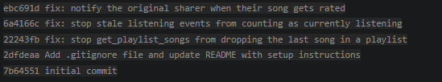

## Codebase Map

Mixtape is a Flask API application. The app is organized so that route files receive HTTP requests, service files contain the main business logic, and model files define the database tables.

### Main files and folders

- `app.py`: Creates the Flask app, configures the database, and registers the routes.
- `models.py`: Defines the main database models such as `User`, `Song`, `Playlist`, `ListeningEvent`, `Notification`, `Rating`, and the playlist/tag join tables.
- `seed_data.py`: Seeds the database with test users, songs, playlists, friendships, listening events, and other sample data used to reproduce bugs.
- `routes/`: Contains endpoint definitions. These files handle incoming API requests, read path/query/body parameters, call service functions, and return JSON responses.
- `services/`: Contains the core business logic for each feature.
  - `search_service.py`: Handles song search.
  - `streak_service.py`: Records listening events and updates user listening streaks.
  - `feed_service.py`: Builds the Friends Listening Now feed and activity feed.
  - `notification_service.py`: Creates and retrieves notifications, and handles notification-related song interactions.
  - `playlist_service.py`: Creates playlists and retrieves playlist songs.

### Pattern I noticed

The project separates request handling from business logic. The route files are thin and mostly delegate work to service files. The service files query or update the database using SQLAlchemy models, then return dictionaries that can be converted to JSON responses.

### Example data flow — rating a song

When a user rates a song, the request goes through the songs route for `POST /songs/<song_id>/rate`. That route passes the user ID, song ID, and rating score to the rating logic in `services/notification_service.py`. The `rate_song()` function checks that the score is valid, loads the song and rater from the database, creates or updates a `Rating` record, and commits the change. After my fix, if the rater is not the original sharer of the song, the service also creates a `song_rated` notification for the song owner.

### Example data flow — retrieving playlist songs

When a user requests `GET /playlists/<playlist_id>/songs`, the route calls `get_playlist_songs()` in `services/playlist_service.py`. That function loads the playlist, queries songs through the playlist join table, orders them by playlist position, and returns each song as a dictionary.

## Issue #1 — My listening streak keeps resetting

### How I reproduced it
I inspected the streak logic in `services/streak_service.py` and focused on the reported Saturday-to-Sunday behavior. The issue happens when a user listened the previous day and the current day is Sunday. In that case, `days_since_last` is 1, but `today.weekday()` is 6.

### How I found the root cause
I looked at the endpoint behavior described in the issue, then traced the streak update logic to `record_listening_event()` and `update_listening_streak()` in `services/streak_service.py`. The suspicious condition was the streak increment check: `days_since_last == 1 and today.weekday() != 6`.

### The root cause
Python's `date.weekday()` returns 6 for Sunday. The code only incremented the streak if the user listened yesterday and today was not Sunday. So when a user listened on Saturday and then again on Sunday, the condition failed and the code reset the streak to 1. This directly matches the user report that the streak reset on Sunday.

### Your fix and side-effect check
I removed the unnecessary Sunday check and changed the condition to only check `days_since_last == 1`. This matches the streak rule because any two consecutive calendar days should increase the streak. I checked that same-day listening still does not increase the streak and that gaps of more than one day still reset the streak to 1.


## Issue #2 — Friends Listening Now shows people from yesterday

### How I reproduced it
I inspected the Friends Listening Now logic in `services/feed_service.py`. The bug report said a friend who listened at 11pm yesterday still appeared around 9am today. That behavior matches a rolling 24-hour window because yesterday at 11pm is still within the last 24 hours.

### How I found the root cause
I traced the endpoint behavior to `get_friends_listening_now()` in `services/feed_service.py`. Inside that function, I found that the cutoff time was calculated using `datetime.now(timezone.utc) - RECENT_THRESHOLD`, where `RECENT_THRESHOLD` was set to 24 hours.

### The root cause
The feature was supposed to show friends who listened today, but the code was checking for friends who listened within the last 24 hours. A rolling 24-hour window allows yesterday evening’s listens to remain visible the next morning, which is exactly what the user reported.

### Your fix and side-effect check
I changed the cutoff from “now minus 24 hours” to the start of the current UTC calendar day. This means the feed only includes listening events from today. I also checked that the function still filters only the current user’s friends, still orders by most recent listen, and still deduplicates to show only one most recent song per friend.

## Issue #3 — The same song keeps showing up twice in search

### How I reproduced it
I tested the search endpoint using `GET /songs/search?q=Anthem` and related terms like `Borough` and `Crown`. In my browser test, the endpoint returned one visible result, but the matching song had multiple tags in the returned data. I then inspected the search query and confirmed that it joined the song table to the tag join table while only filtering by title and artist. This creates the duplicate condition when a matching song has multiple joined tag rows.

### How I found the root cause
I started from the endpoint /songs/search?q=Anthem and searched the codebase for the search function. I found services/search_service.py and looked at search_songs(). The function queried Song but also joined the song_tags table even though the filter only checked Song.title and Song.artist.

### The root cause
The search query used an outer join to song_tags. Since one song can have multiple tags, the join can create multiple database rows for the same song. The search logic did not need this join because it was not filtering by tags. This created a duplicate-result risk for songs with multiple tags.

### Your fix and side-effect check
I removed the unnecessary outer join from the search query and kept the filter on Song.title and Song.artist. The song tags are still included through song.to_dict(), so the response still contains tags. I retested searches for Anthem and Borough to confirm the matching song still appears once.


## Issue #4 — I got notified when a friend added my song to a playlist but not when they rated it

### How I reproduced it
I inspected the notification behavior described in the issue. Playlist notifications worked when a friend added a shared song to a playlist, but rating a shared song only saved the rating and did not create a notification. I traced this through `services/notification_service.py`.

### How I found the root cause
I compared the working playlist notification path with the rating path in `services/notification_service.py`. The `add_to_playlist()` function called `create_notification()` after adding the song to a playlist. The `rate_song()` function saved or updated the rating, committed it, and returned the rating without calling `create_notification()`.

### The root cause
The rating logic was missing the notification creation step. The app saved the rating correctly, but there was no code that created a `song_rated` notification for the original sharer of the song. This is why the rating appeared on the song, but the owner never saw a notification.

### Your fix and side-effect check
I added a notification after the rating is committed. If the rater is not the original sharer, the app now creates a `song_rated` notification for the song owner. I also kept the self-notification guard so users do not receive notifications when rating their own songs. I checked that the existing rating save/update behavior still remains unchanged.

## Issue #5 — The last song in a playlist never shows up

### How I reproduced it
I inspected the playlist retrieval logic for `GET /playlists/<playlist_id>/songs`. The user report said the playlist count showed one more song than the endpoint returned, and the missing song was always the newest one. This matched the behavior of code that removes the final item from a list.

### How I found the root cause
I traced the playlist songs endpoint to `get_playlist_songs()` in `services/playlist_service.py`. The function queried songs in playlist order using `playlist_entries.c.position`, then returned `songs[:-1]`.

### The root cause
The code used Python slicing `songs[:-1]`, which means “all items except the last one.” Because songs are ordered by playlist position, the last item is the most recently added song. This caused the endpoint to always hide the newest song.

### Your fix and side-effect check
I changed the return statement from `songs[:-1]` to `songs`, so the function returns every song in the playlist. I checked that the ordering logic still stays the same because the query still orders by `playlist_entries.c.position`.


## AI Usage

I used AI as a debugging guide and explanation partner during this project. I asked it to help me understand unfamiliar service files, explain suspicious logic, and compare similar code paths. For example, I used AI to reason through the streak logic in `services/streak_service.py`, the playlist slicing behavior in `services/playlist_service.py`, and the difference between the working playlist notification path and the missing rating notification path in `services/notification_service.py`.

I did not rely on AI alone to make changes. I verified the suggestions by reading the actual code, checking the project issue descriptions, running the Flask app locally, testing endpoints in the browser, and reviewing the affected service files myself. When the search duplicate issue did not reproduce clearly from the browser response, I documented that and used the code structure to identify the risky join that could cause duplicate rows.

## Git Log Screenshot
## Git Log Screenshot

Screenshot included in submission showing:

```text
ed11ba5 fix: return all songs in playlist
7c177fb fix: notify song sharer when their song is rated
70ee56c fix: limit listening now feed to today's events
f713f65 fix: allow listening streaks to continue on Sunday
25f2fb4 fix: remove unnecessary tag join from song search


